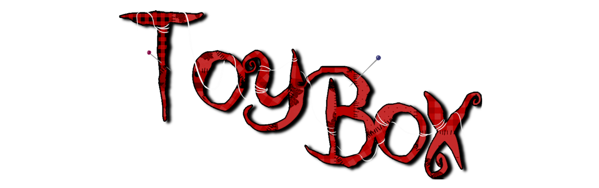

# Toy Box

This is Annie’s story, Margot’s favorite ragdoll. She’s been tired of waiting for her owner’s
return, so, she decides to escape from the toy box. However, the other toys will be always
trying to stop her leaving, because if she does, Margot may never return.

Take control of Annie and fight your way out, lest you are forever trapped... in the Toy Box.

This is a game being developed by students from <a href="https://www.imagecampus.edu.ar/">Image Campus</a>

   

## Credits

- **Juan Cruz Tourret** - *Programming*
- **Tomas Aquistapace** - *Programming*
- **Sofia Nadia Oliva** - *Art*
- **Juan Manuel Fernandez** - *Art*
- **​Andres Montana Duret** - *Audio*
- **Sebastian Mino** - *Audio*
- **Joaquín Otero** - *Audio*
- **Pablo Santagiuliana** - *Testing*
- **Juan Alvarez** - *Testing*
- **Sebastian Carrizo Rodas** - *Testing*

This game was also possible thanks to the support of these professors:

- **Sergio Baretto**
- **Federico Barra**
- **Ramiro Cabrera**
- **Lucía Inés Patetta**
- **Nazareno Rivero**
- **Eugenio Taboada**

## Links

Download it from itch.io: https://potato211.itch.io/toy-box
